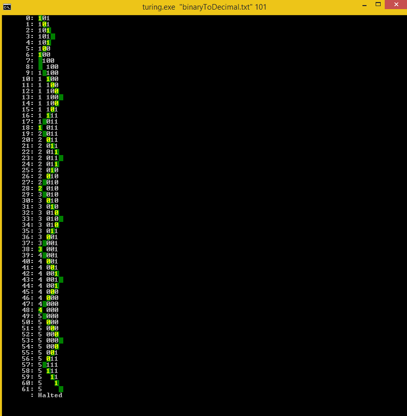

Universal-Turing-Machine
========================

Universal turing machine emulator run from command line.
The user specifies some turing machine instruction to be emulated against an input string.
At each step of the turing machine the turing machine tape is displayed along with the tape cursor position.

* The machine runs until one of three events happen:
 * The Turing machine finishes successfully when the "halt" state is reached.
 * The Turing machine crashes due to being badly designed and/or badly formed input string.
 * Time stands still (infinite loop)

Usage: turing [Turing Machine Instructions Filepath] [Input String]

Example: turing "BinaryToDecimal.txt" 101

    "BinaryToDecimal.txt"
    ---------------------
    0 * * R 0
    0 _ _ L 1

    1 0 1 L 1
    1 _ _ R C
    1 1 0 L 2
    2 * * L 2
    2 _ _ L 3

    3 9 0 L 3
    3 _ 1 R 4
    3 0 1 R 4
    3 1 2 R 4
    3 2 3 R 4
    3 3 4 R 4
    3 4 5 R 4
    3 5 6 R 4
    3 6 7 R 4
    3 7 8 R 4
    3 8 9 R 4

    4 * * R 4
    4 _ _ R 0

    C * _ R C
    C _ _ * halt
